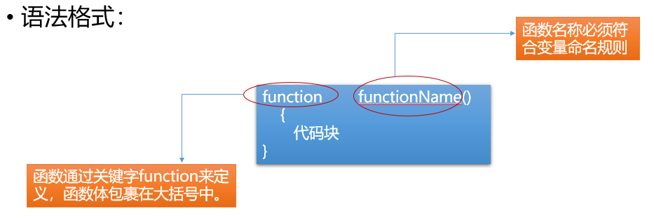
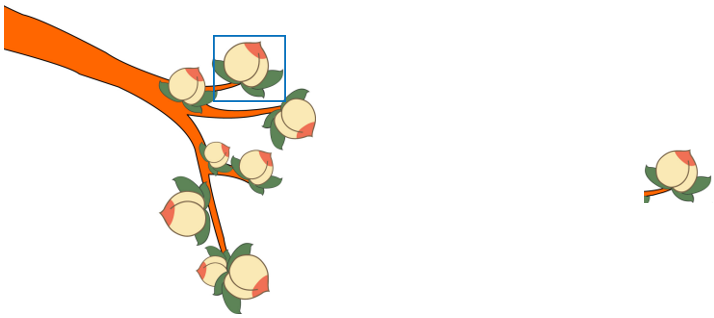

[TOC]
# 一、流程控制
## 1. 作用
控制代码的执行顺序
## 2. 分类
#### 1）顺序结构
从上到下依次执行代码语句


```html
<title>顺序结构</title>
<!-- 引入外部的css和js -->
<!-- href属性会去对应文件的位置获取数据,src属性会将对应的文件下载到当前页面. -->
<!-- css不会影响页面加载,当css样式没找到时,浏览器也会继续向下执行. -->
<!-- js中的内容会直接在当前页面执行,如果未执行完毕,会阻塞当前页面的加载. -->
<!-- 写在head中的script会作为body的第一个子元素运行． -->
<!-- 多个script按顺序执行 -->
<link rel="stylesheet" href="index.css">
<script src="index.js"></script>
```


#### 2）分支/选择结构

##### 1. if语句
+ 简单if结构
  ``` text
  if(条件表达式){
  	表达式成立时执行的代码段
  }
  ```
  ```html
  <script>
          var age=prompt("请输入您的年龄");
          //age<30 隐式转换
          if(age<30){
              alert("都是青年");
          }    
  </script>
  ```
  
  
  
  注意 : 除零值以外，其他值都为真，以下条件为假值false
  
  ```javascript
  if(0){}
  if(0.0){}
  if(""){} //空字符串
  if(undefined){}
  if(NaN){}
  if(null){}
  ```
  特殊写法 :
  	{ }可以省略,一旦省略，if语句只控制其后的第一行代码
  
+ if - else结构
	```text
	if(条件表达式){
  	//条件成立时执行
  }else{
  	//条件不成立时选择执行
  }
  ```
  
+ 多重分支结构
    ```javascript
      if(条件1){
      	//条件1成立时执行
      }else if(条件2){
      	//条件2成立时执行
      }else if(条件3){
      	//条件3成立时执行
      }...else{
      	//条件不成立时执行
      }
    ```

```html
<script>
        var age=prompt("请输入您的年龄");
        //age<30 隐式转换
        if(age<30){
            alert("都是青年");
        }else if(age<60){
            alert("人到中年不得已,保温杯里泡枸杞.")
        }else{
            alert("最美夕阳红.")
        }
</script>
```


##### 2. switch语句

+ 语法 :
```javascript
switch(value){
	 case 值1 :
	 //value与值1匹配全等时,执行的代码段
	 break; //结束匹配
	 case 值2 :
	 //value与值2匹配全等时,执行的代码段
	 break;
	 case 值3 :
     //value与值3匹配全等时,执行的代码段
	 break;
	 default:
 	 //所有case匹配失败后默认执行的语句
 	 break;
}
```
+ 使用 :
```javascript
1. switch语句用于值的匹配，case用于列出所有可能的值；只有switch()表达式的值与case的值匹配全等时，才会执行case对应的代码段
2. break用于结束匹配，不再向后执行；可以省略，break一旦省略，会从当前匹配到的case开始，向后执行所有的代码语句，直至结束或碰到break跳出
3. default用来表示所有case都匹配失败的情况，一般写在末尾，做默认操作
4. 多个case共用代码段
  		case 值1:
  		case 值2:
  		case 值3:
  		//以上任意一个值匹配全等都会执行的代码段
```


#### 3）循环结构

+ 作用
根据条件，重复执行某段代码
+ 分类
1. while循环
```text
定义循环变量;
   while(循环条件){
   条件满足时执行的代码段
   更新循环变量;
}
```
```html
var i=1;
    while(i<=20){
        console.log(i);
        i++;
    } 
```


1. do-while循环
```text
do{
	循环体;
	更新循环变量
}while(循环条件);
```
```html
var i=1;
    do{
        console.log(i);
        i++;
    }while(i<20); 
```

```html
练习:
请用户输入用户名,如果用户名不是bob就重复输入,如果是bob就退出.
<script>
    var name;
    do{
        console.log(name=prompt("please input your name:"));
    }while(name!="bob");    
</script>
```


与 while 循环的区别 :

+ while 循环先判断循环条件，条件成立才执行循环体
+ do-while 循环不管条件是否成立，先执行一次循环体

3. for 循环
```text
for(定义循环变量;循环条件;更新循环变量){
	循环体;
}
```
```html
<script>
        for(var i=1;i<=10;i++){
            console.log(i);
        }    
</script>
```

```html
<script>
        for(var i=0;i<20;i++){
            // 输出0-5的数
            if(i>5){
               break; 
            }
            console.log(i);
        }    
</script>
```

```html
<script>
        for(var i=0;i<20;i++){
            // 输出偶数
            if(i%2==0){
               console.log(i); 
            }
            
        }    
</script>
```


循环控制 :

1. break 强制结束循环
2. continue 结束当次循环，开始下一次循环
   循环嵌套 :
   在循环中嵌套添加其他循环


# 二、函数



## 1. 作用 

  	封装一段待执行的代码

## 2. 语法 

```javascript
  //函数声明
  function 函数名(参数列表){
  	函数体
  	return 返回值;
  }
  //函数调用
  函数名(参数列表);
```


## 3. 使用 

  	函数名自定义，见名知意，命名规范参照变量的命名规范。普通函数以小写字母开头，用于区分构造函数(构造函数使用大写字母开头，定义类)

```html
<script>
        function sayHello(){
            alert("hello world");
        }
        sayHello() //调用函数
</script>
```

```html
    <script>
        //带参数
        function myadd(a,b){
            return a+b;
        }
        console.log(myadd(4,5)); //9
    </script>
```

```html
    <script>
        //默认传参
        function myadd(a=10,b=20){
            return a+b;
        }
        console.log(myadd()); //30
    </script>
```

```html
<script>
        function myadd(a=10,b=20){
            return a+b;
        }
        console.log(myadd(a=20,b=30)); //50
</script>
```


## 4. 匿名函数

匿名函数：省略函数名的函数。语法为：

- 匿名函数自执行

```javascript
 (function (形参){
  
 })(实参);
```

- 定义变量接收匿名函数

```javascript
 var fn = function (){};
 fn(); //函数调用
```


## 5. 作用域

JavaScript 中作用域分为全局作用域和函数作用域，以函数的{ }作为划分作用域的依据

1. 全局变量和全局函数
   - 只要在函数外部使用 var 关键字定义的变量，或函数都是全局变量和全局函数，在任何地方都可以访问
   - 所有省略 var 关键字定义的变量，一律是全局变量
   
2. 局部变量/局部函数
   
   - 在函数内部使用 var 关键字定义的变量为局部变量，函数内部定义的函数也为局部函数，只能在当前作用域中使用，外界无法访问
   
3. 作用域链
   局部作用域中访问变量或函数，首先从当前作用域中查找，当前作用域中没有的话，向上级作用域中查找，直至全局作用域
   
   ```html
   //声明提前
   //当JS加载时,会把所有的全局变量名和函数名提前到最上方.
   //如果是函数名提前,会携带函数体.
   //如果变量名提前,那么变量的值留在原地.
   ```
   
   


## 6. 获取多个DOM元素和控制属性

1. 根据标签名获取元素节点列表

```javascript
var elems = document.getElementsByTagName("");
/*
参数 : 标签名
返回值 : 节点列表,需要从节点列表中获取具体的元素节点对象,添加相应下标。
*/
```

```html
<body>
    <ul id="nav">
        <li>1</li>
        <li>2</li>
        <li>3</li>
    </ul>
    <script>
        window.onload=function(){
            // 通过标签名查找元素
            var lis=document.getElementsByTagName("li");
            console.log(lis);
            // 通过索引修改页面文本
            lis[0].innerHTML="<h1>第一个li</h1>";
            lis[1].innerText="第二个li";
        }
    </script>
</body>
```


1. 根据 class 属性值获取元素节点列表

```JavaScript
var elems = document.getElementsByClassName("");
/*
参数 : 类名(class属性值)
返回值 : 节点列表
*/
```

```html
<body>
    <ul id="nav">
        <li class="item">1</li>
        <li class="item">2</li>
        <li class="item">3</li>
    </ul>
    <script>
        window.onload=function(){
            // 通过类名查找元素
            var lis=document.getElementsByClassName("item");
            console.log(lis);
        }
    </script>
</body>
```

```html
练习：
<body>
    <input type="text" id="text">
    <div id="show"></div>
    <script>
        window.onload=function(){
            // 查找页面元素
            var input=document.getElementById("text");
            var div=document.getElementById("show");
            // 当用户输入完毕时,找到input的内容,将值放到div的元素中.
            // 用户的光标离开时，触发失去焦点事件。
            input.onblur=function(){
                var val=input.value;
                console.log(val);
                div.innerHTML=val;
            }
            
        }
    </script>
</body>
```


1. 元素节点对象提供了以下属性来操作元素内容

```text
innerHTML : 读取或设置元素文本内容,可识别标签语法
innerText : 设置元素文本内容,不能识别标签语法
value : 读取或设置表单控件的值
```

4. 获取 DOM 树中的属性值



6. 设置 DOM 树中的属性值：


```javascript
elem.getAttribute("attrname");//根据指定的属性名返回对应属性值
elem.setAttribute("attrname","value");//为元素添加属性,参数为属性名和属性值
elem.removeAttribute("attrname");//移除指定属性
```

```html
<!DOCTYPE html>
<html lang="en">
<head>
    <meta charset="UTF-8">
    <meta name="viewport" content="width=device-width, initial-scale=1.0">
    <meta http-equiv="X-UA-Compatible" content="ie=edge">
    <title>Document</title>
    <style>
    div{
        width:100px;
        height:50px;
        
        border:1px solid red;
        font-size: 32px;
        line-height: 50px;
        text-align:center;
        position:fixed;
        right:0;
        bottom:0;
    }
    span{
        float:left;
        width:15px;
        height:15px;
        background-color: gainsboro;
        position:absolute;
        top:0px;
        right:0px;
        font-size:16px;
        line-height: 15px;
        text-align:center;
    }
    .hide{
        display:none;
    }
    </style>
</head>
<body>
    <div id="parent">
        click
        <span id="child">X</span>
    </div>
    <script>
        var child=document.getElementById("child");
        var parent=document.getElementById("parent")
        child.onclick=function(){
            parent.setAttribute("class","hide")
        };
    </script>
    
</body>
</html>
```

